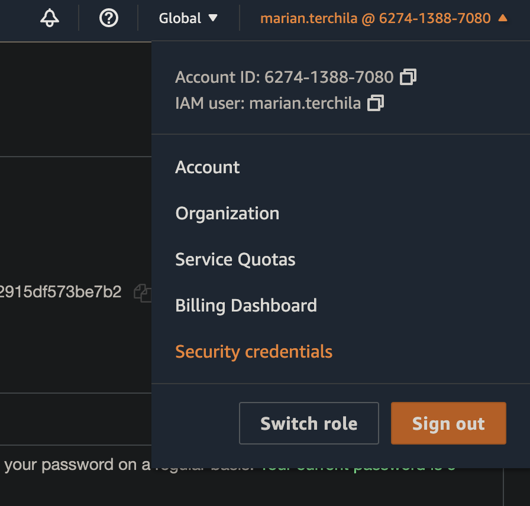
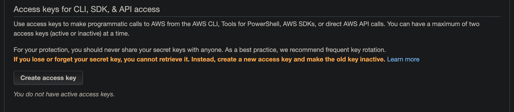
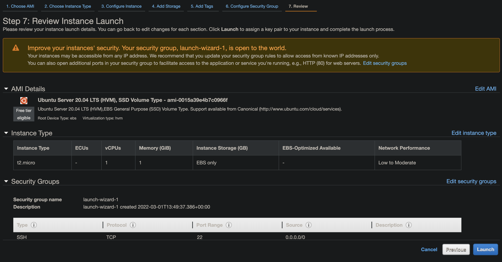
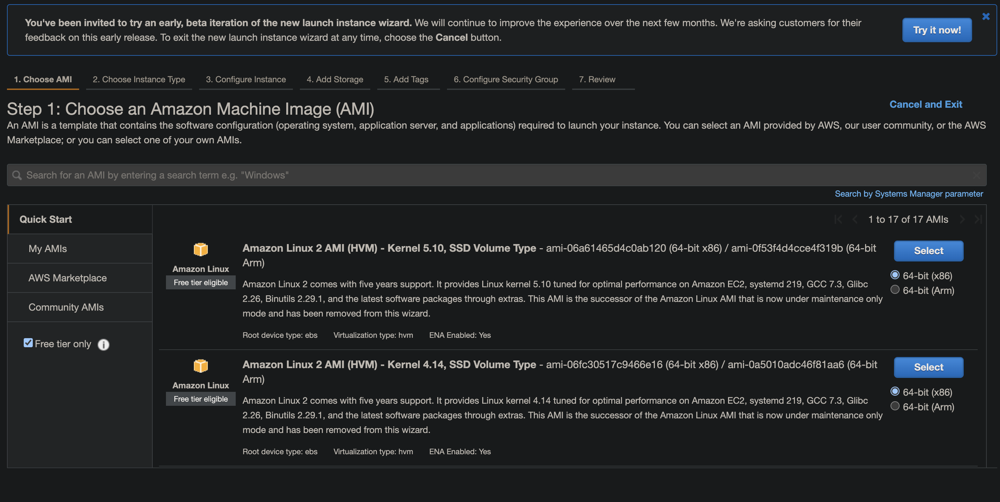
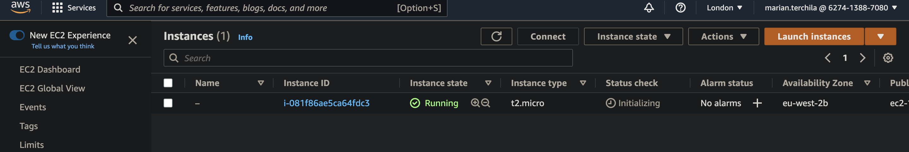
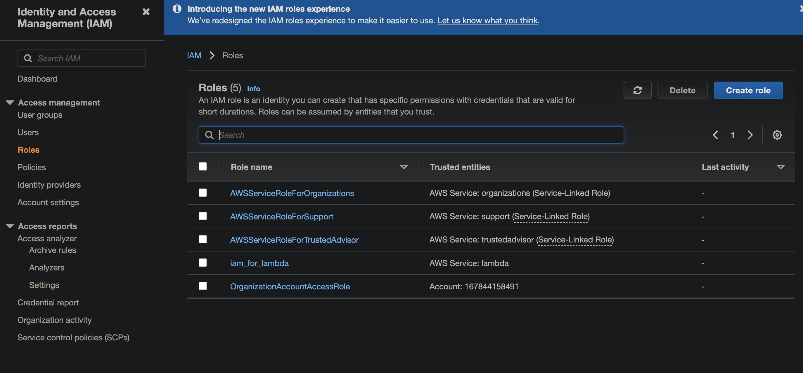
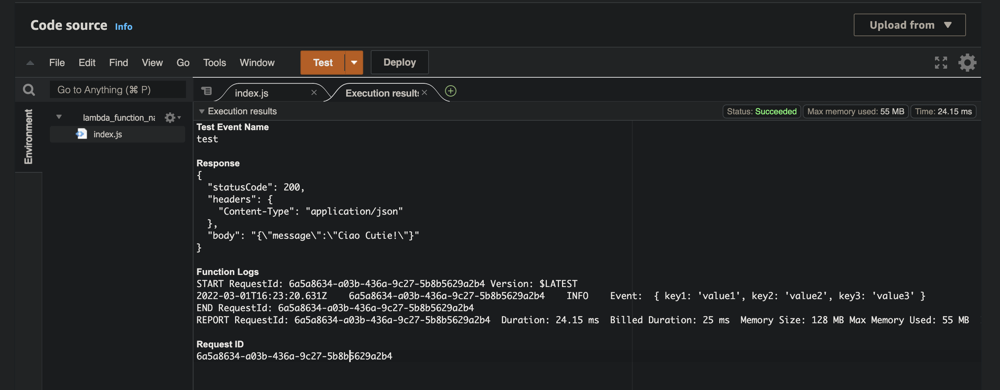

# Terraform AWS Crash Course

<aside>
💡 This guide is meant to offer a quick start up for the developers new to Terraform. Please refer to the Terraform documentation for a more in depth explanation of every functionality covered in this crash course. 

This guide only provides bare bone setup instructions, the scope of this course is to familiarize ourselves with AWS and Terraform so best practices and security methods are out of the scope of this guide.

At the end of the guide you should be able to find the source code for everything that we covered in this guide.

</aside>

# Introduction

Terraform manages resources in a declarative manner. By that I mean that the instructions of our files will not be carried out step by step as we would probably expect. Instead, Terraform is going to ensure that our code matches our state (what we have in the cloud) and make the changes, if needed so that our code matches the state.

Ultimately, the take away from this is that Terraform does not create the resources in the order they are enumerated inside the file. Terraform is smart enough to figure out the right order when creating the resources.

Do not ever mess with the state files. In the event where you change something directly in the state file terraform will be unable to function accordingly. 

## Init a new project

Create a new folder, the `main.tf` file and initialize the terraform project

```bash
mkdir tf_aws_sandbox && cd tf_aws_sandbox && touch main.tf && terraform init
```

# 1. AWS Setup

## Generate keys

First thing you need to get your set of keys from AWS so we can connect to your account from terraform. If you do not have them already this section will cover how to generate them.

1. Click on your profile
2. Security credentials
    
    
    
3. Create access keys
    
    
    
    Download the `.csv` locally after creation or you wont be able to ever see both keys again and have to delete the newly created key pair and create a new set.
    
4. OPTIONAL: Add the new keys to the bash profile
    
    This is to ensure we do not do anything on our local stack by accident
    
    1. Open file

```bash
nano ~/.zshrc # or whatever bash profile you have
```

        2. Add the keys as env vars

```bash
export AWS_ACCESS_KEY_ID=
export AWS_SECRET_ACCESS_KEY=
```

# 2. Terraform

This section will detail bare bone implementation of the most known and used AWS resources. Baer in mind that it is out of the scope of this guide to cover security best practices.

## Create the provider

Thorough the `aws` provider we can connect to our AWS account using the set of keys prior mentioned in the section above. 

```bash
# main.tf
provider "aws" {
    # AWS REGION
    region = "eu-west-2"
    # AWS CREDENTIALS
    access_key = ""
    secret_key = ""
}
```

TODO: Fill in with your credentials

## How to provision AWS with resources

One of the nicest parts of terraform. And is really the main selling point of terraform is that, regardless of what provider you're using, so whether you're trying to create a resource within AWS, or a resource within Azure or GCP, it's going to use the same exact syntax from a terraform side, so that you don't actually have to learn the underlying API from you know, Azure, or AWS, or GCP. And the main syntax is going to be you type in the word resource.

The following syntax is similar when creating any type of resource

```bash
resource "<provider>_<resource_type>" "name" {
# stuff goes in here
}
```

Please refer to the link below for the `resource_type`

[Terraform Registry](https://registry.terraform.io/providers/hashicorp/aws/latest/docs)

Before moving forward, it would be a good idea to see how you can create those resources from the `console` . After that the following bit will make more sense.

## EC2

### **AMIs & Manual workflow**

An AMI is just an image i.e. ubuntu, fedora 

To see the available AMIs:

1. Go to AWS console
2. EC2 
3. Launch instance
4. Select an image, be sure you are on the free tier
5. Review and launch. It should look something similar to the image below
6. Proceed without a key pair
7. You do not need to launch the instance, this was just a recap of the workflow in the console so it will make more sense when automating that with terraform



For learning purposes be sure you have the Free tire only checked. You shouldn’t be charged for creating one of those. Just be sure you shut it down accordingly once you are done with it.



### **Create it using Terraform**

To your existing [`main.tf`](http://main.tf) file, where you have the provider from the section 1 add the following

```bash
# main.tf
resource "aws_instance" "test_terraform_ec2" {
  # to find the ami go on the aws console, ec2, launch instance
  # this ami might not work as they change the amis quite often
  ami           = "ami-0015a39e4b7c0966f"
  instance_type = "t2.micro"
}
```

```bash
terraform plan
terraform apply # type yes and press enter
```

This might take a few moments. Expected output below

```bash
➜  aws terraform apply

...

Do you want to perform these actions?
  Terraform will perform the actions described above.
  Only 'yes' will be accepted to approve.

  Enter a value: yes

aws_instance.test_terraform_ec2: Creating...
aws_instance.test_terraform_ec2: Still creating... [10s elapsed]
aws_instance.test_terraform_ec2: Still creating... [20s elapsed]
aws_instance.test_terraform_ec2: Still creating... [30s elapsed]
aws_instance.test_terraform_ec2: Creation complete after 31s [id=i-081f86ae5ca64fdc3]

Apply complete! Resources: 1 added, 0 changed, 0 destroyed.
```

**To verify our resource was created:**

1. Go to AWS console
2. EC2
3. Instances (running)

There you should find something similar to the image below



### Updating resources

Now if you are to update the `[main.tf](http://main.tf)` file with some other configs to our EC2 instance, Terraform will update the current existing instance according to our modifications. 

It will not create a new instance, but update our current one

```bash
# main.tf 
resource "aws_instance" "test_terraform_ec2" {
  # to find the ami go on the aws console, ec2, launch instance
  # this ami might not work as they change the amis quite often
  ami           = "ami-0015a39e4b7c0966f"
  instance_type = "t2.micro"
  tags = {
      Name = "EC2_Ubuntu_Test"
  }
}
```

```bash
terraform apply
```

In the output you should see the list of changes that have been made, those changes could also be previewed using

```bash
terraform plan
```

**Destroy the instance using terraform**

```bash
terraform destroy
```

Double check at the end that your instance was destroyed

Lambda function

### IAM

When creating a new lambda it is ideal to have a separate IAM for it. This can be achieved in terraform using the code below

```bash
resource "aws_iam_role" "iam_for_lambda" {
  name = "iam_for_lambda"

  assume_role_policy = <<EOF
{
  "Version": "2012-10-17",
  "Statement": [
    {
      "Action": "sts:AssumeRole",
      "Principal": {
        "Service": "lambda.amazonaws.com"
      },
      "Effect": "Allow",
      "Sid": ""
    }
  ]
}
EOF
}
```

To verify that our code worked refer to the AWS console and see if it has created the new IAM. You should have the `iam_for_lambda` created



### Local variables

As the code to provision the `lambda function` has to be inside a `.zip` file we will set up local variables that we can use later on as references for the archiving process and the creation of the lambda process.

```bash
# LOCAL VARIABLES
locals {
  lambda_zip_name     = "lambda_code.zip"
  lambda_zip_location = "${path.module}/${local.lambda_zip_name}"
}
```

### Creating the .zip file

Make your folder structure to resemble the one below

```bash
.
├── lambda_code.zip
├── main.tf
├── resources
│   └── lambda
│       └── index.js
├── terraform.tfstate
└── terraform.tfstate.backup
```

Inside the `resources/lambda/index.js` paste the contents from below

```bash
module.exports.handler = async (event) => {
    console.log('Event: ', event);
    let responseMessage = 'Ciao Cutie!';
  
    return {
      statusCode: 200,
      headers: {
        'Content-Type': 'application/json',
      },
      body: JSON.stringify({
        message: responseMessage,
      }),
    }
  }
```

Now we need to make a zip file using the lambda code from earlier.

```bash
# main.tf
# CREATE ZIP FIE
data "archive_file" "init" {
  type        = "zip"
  source_file = "${path.module}/resources/lambda/index.js"
  output_path = local.lambda_zip_location
}
```

### Lambda

```bash
# main.tf
resource "aws_lambda_function" "test_lambda" {
  filename      = local.lambda_zip_name
  function_name = "lambda_function_name"
  role          = aws_iam_role.iam_for_lambda.arn
  handler       = "index.handler"

  source_code_hash = filebase64sha256("${local.lambda_zip_location}")

  runtime = "nodejs12.x"

  environment {
    variables = {
      testing = "is cool"
    }
  }
}
```

Note that for the role bit we are getting the `arn` from the `iam resource`
We access that with `resource.name.arn`

BONUS: at the end we define the `testing environment variable`

Now you need to apply the changes and check inside the AWS console if everything went through.

You should be able to make a test for the function and that should have a valid return. See below



**To recap**

1. We set up a new IAM role for our lambda
2. We define the local variables for the filename and the file location of the zip file
3. We zip our code
4. We create the lambda instance, provision it with our code and set up the env vars

## S3 Bucket

```bash
# main.tf
**resource "aws_s3_bucket" "test_terraform_bucket" {
  tags = {
    Name        = "terraformBucket"
    Environment = "Dev"
  }
}

resource "aws_s3_bucket_acl" "test_terraform_bucket_acl" {
  bucket = aws_s3_bucket.test_terraform_bucket.id
  acl    = "private"
}**
```

The **`test_terraform_bucket`** resource creates the bucket, whilst the  **`test_terraform_bucket_acl`** sets up the access control list.

### SQS

```bash
# main.tf
resource "aws_sqs_queue" "terraform_deadletter_queue" {
  name = "deadletterQueue"
}
```

The above is a bare bone example of how a queue can be created. 

```bash
# main.tf
resource "aws_sqs_queue" "test_terraform_queue" {
  name                      = "terraform_example_queue"
  delay_seconds             = 90
  max_message_size          = 2048
  message_retention_seconds = 86400
  receive_wait_time_seconds = 10
  # SET UP DEAD LETTER QUEUE  
  redrive_policy = jsonencode({
    deadLetterTargetArn = aws_sqs_queue.terraform_deadletter_queue.arn
    maxReceiveCount     = 4
  })
  # DEAD LETTER QUEUE PERMISSIONS
  redrive_allow_policy = jsonencode({
    redrivePermission = "byQueue",
    sourceQueueArns   = ["${aws_sqs_queue.terraform_deadletter_queue.arn}"]
  })

  tags = {
    Environment = "Dev"
  }
}
```

To expand on that, we now created a more complex queue where we define the delay, max message size, we set up the dead letter queue for our new queue (the one we created a step before, and the permissions for this queue)

```bash
# main.tf 
resource "aws_sqs_queue_policy" "test_terraform_queue_policy" {
  queue_url = aws_sqs_queue.test_terraform_queue.id

  policy = file("${path.module}/resources/SQS/delivery_policy.json")
}
```

Furthermore, we took this one step ahead and set up a filter policy based on the data from the `resources/SQS/delivery_policy.json` file.

I recommend doing this for the configuration files, as this is easier to maintain
In the Lambda section, for the IAM resource we could do the same thing

```json
# resources/SQS/delivery_policy.json
{
    "Version": "2012-10-17",
    "Id": "sqspolicy",
    "Statement": [
      {
        "Sid": "First",
        "Effect": "Allow",
        "Principal": "*",
        "Action": "sqs:SendMessage",
        "Resource": "${aws_sqs_queue.test_terraform_queue.arn}"
      }
    ]
  }
```

## SNS

### Create a topic

```bash
# main.tf
resource "aws_sns_topic" "test_terraform_topic" {
  name            = "cute_topic"
  delivery_policy = file("${path.module}/resources/SNS/topic/delivery_policy.json")
}
```

### Subscribe a queue to the topic

```bash
# main.tf
resource "aws_sns_topic_subscription" "test_terraform_subscription_queue" {
  topic_arn = aws_sns_topic.test_terraform_topic.arn
  protocol  = "sqs"
  endpoint  = aws_sqs_queue.test_terraform_queue.arn
  filter_policy = file("${path.module}/resources/SNS/subscription/filter_policy.json")
}
```

Create the file `resources/SNS/subscription/filter_policy.json` and paste in the contents from below

```bash
{
  "anyMandatoryKey": ["any", "of", "these"],
  "anyOtherOptionalKey": ["any", "of", "these"]
}
```

### Subscribe the lambda function to the topic

```bash
# main.tf
resource "aws_sns_topic_subscription" "test_terraform_subscription_lambda" {
  topic_arn     = aws_sns_topic.test_terraform_topic.arn
  protocol      = "lambda"
  endpoint      = aws_lambda_function.test_lambda.arn
}
```

## Parameter store

```bash
# main.tf
resource "aws_ssm_parameter" "test_terraform_parameter" {
  name  = "ciao"
  type  = "String"
  value = "cutie"
}

resource "aws_ssm_parameter" "test_terraform_parameter2" {
  name  = "supersecret"
  type  = "SecureString"
  value = "megasecret"
}
```

The first parameter creates a simple string, whilst the second one creates a secure string

# Takeaways

If you made it this far I’d like to congratulate you. Hopefully now you’ve got a better understanding of terraform and how to work the AWS provider.

We only covered a hand full of AWS resources in this guide, to find our more about the rest of the parameters for each resource and what other resources you can use please refer to the link below.

[Terraform Registry](https://registry.terraform.io/providers/hashicorp/aws/latest/docs)

Ultimately, although you should not be charged a pence for following along with this tutorial I’d like to remind you to double check that everything was destroyed on the AWS console.

# Download Code

[terraform_aws_crashcourse.zip](./terraform_aws_crashcourse.zip)